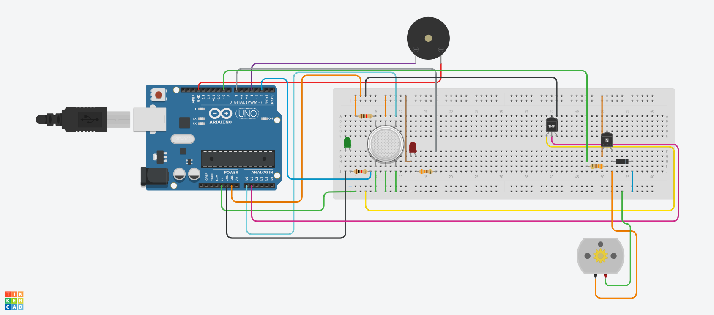

# Smart Room Smoke & Temperature Monitoring System (Tinkercad + Arduino)

**Author:** Goda Gutparakyte  
**Course:** Intro to Robotics @ Vilnius University  
**Assignment:** HW1: Creative build
**Last Updated:** 2025-09-22  

---

## Project Overview
This project simulates a **smart room monitoring system** using Arduino in **Tinkercad**.  
The system monitors **smoke (gas levels)** and **temperature**, then reacts using different actuators:

- **Smoke sensor** → triggers **buzzer** + **red LED** alert if smoke is detected.  
- **Temperature sensor** → turns on a **fan (DC motor)** when the room is too hot.  
- **Status LED** → shows **green** when everything is safe.  

---

## Components Used
- Arduino Uno  
- **Smoke sensor** (simulated gas sensor on analog pin A0)  
- **Temperature sensor** (TMP36 on analog pin A1)  
- Buzzer (digital pin 4)  
- LEDs:  
  - Red LED (digital pin 7) 
  - Green LED (digital pin 2)
- DC Motor (as a fan, on PWM pin 9)
  - Diode
  - NPN transistor 
- Resistors and breadboard wiring
---

## Behavior
- **Smoke detected:**:
  - Green LED off
  - Red LED starts blinking
  - Buzzer goes off
    
- **Smoke not detected:**  
  - Green LED is on  
  - Red LED is off  
  - Buzzer does not ring 

- **High Temperature Detected:**  
  - Fan (DC motor) turns on to cool down the room  

---

## Pictures

### Circuit in Tinkercad

---

## How to Run 
1. Start simulation.  
2. Adjust the **smoke sensor** and **temperature sensor** values in Tinkercad to test alarm and cooling behavior.  

---

## Future improvements
- Make the fan (DC motor) speed change according to the temperature (if it is hotter, fan is stronger and vice versa)
- Show sensor readings on LED screen
- add a servo-controlled window to automatically open when smoke is detected
